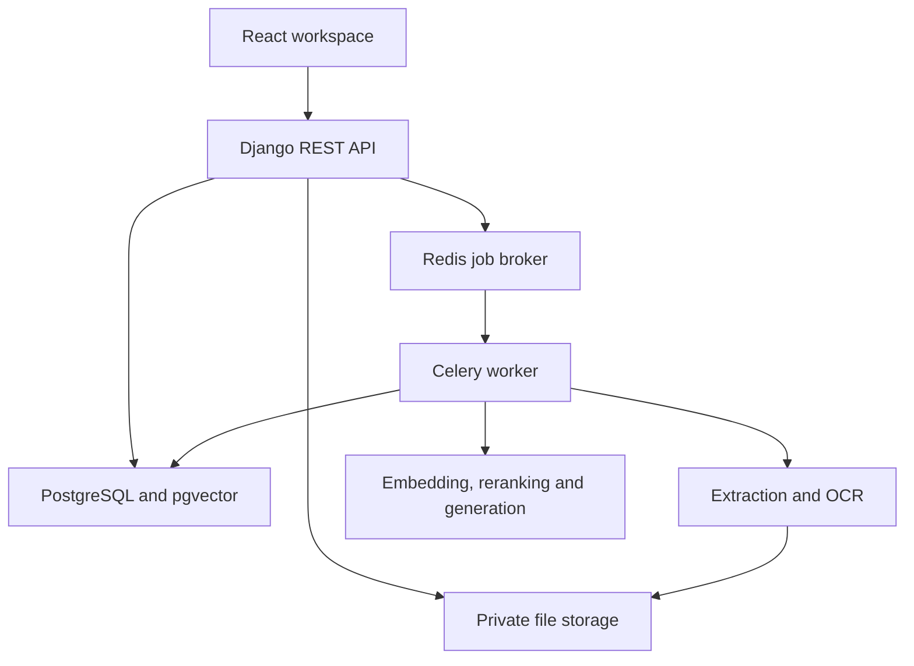
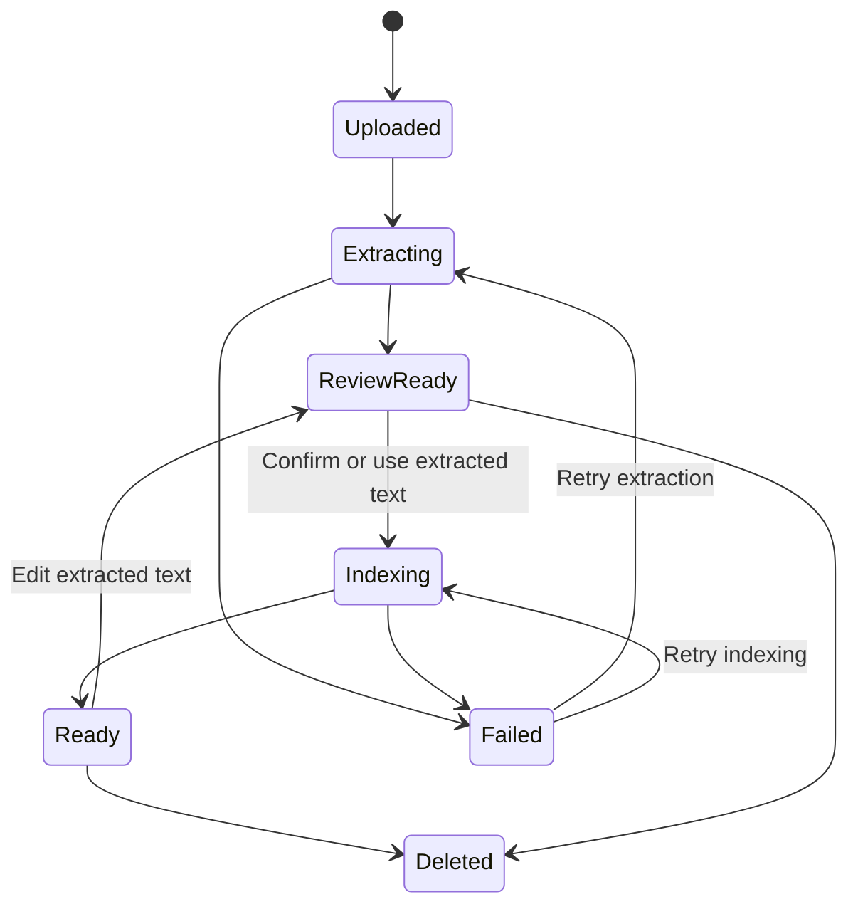
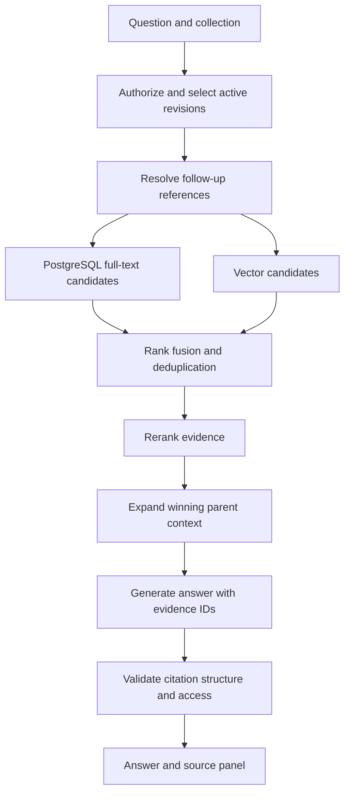
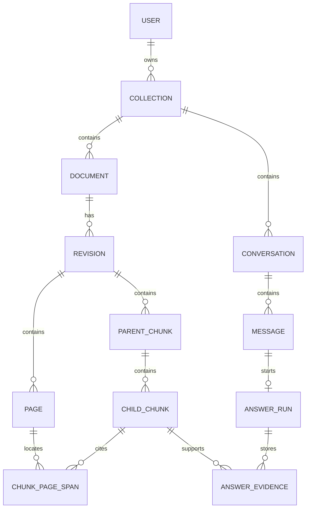

# DocInsight — Software Requirements and Architecture

Version: 1.0 | Prepared: 4 October 2026 | Owner: Danial Wajahat

Status: Implementation specification for a portfolio MVP. This document describes proposed behaviour, not an already implemented product. Requirements labelled P0 define the 15-day release; P1 and P2 are later work.

## 1. Introduction

DocInsight is a general document workspace that answers questions using uploaded evidence. Users can organise documents for meetings, training, study, business operations, product manuals, research, or personal administration. The product is not restricted to software agencies or client projects.

The domain is general; the supported formats and behaviour are deliberately bounded. The MVP handles English printed text in readable PDFs, scanned PDFs, and PNG/JPEG page images. It does not claim to understand every document, handwriting, diagrams, or every language. A supported format may still produce incomplete extraction. The interface must expose that limitation.

### Problem

Information is spread across long documents, scans, and meeting records. Keyword search misses paraphrased questions. Simple PDF chat often separates a paragraph from its heading or warning, retrieves the wrong context, and provides answers that users cannot verify.

### Proposed solution

Upload documents into a collection, inspect extracted content, ask a question, and read an answer beside its supporting pages. Use OCR when required, structure-aware parent–child chunks, hybrid retrieval, and reranking. Store source identifiers and page references through the entire pipeline.

### Users and value

Students, office professionals, freelancers, analysts, and small teams outside Pakistan can all use the same workflow. Collections are generic containers such as “Meeting records,” “Product manuals,” and “Study material.” Each MVP collection is private to one owner; shared team collections are P1.

### Success criteria

- A fresh user can upload a supported file and reach a cited answer without using the terminal.
- A scanned document works through the same question-answering flow as a text PDF.
- Users can inspect and correct extracted text before indexing it.
- Each displayed citation resolves to an accessible original page and extracted evidence.
- Unsupported questions produce an explicit “Insufficient evidence” answer rather than invented facts.
- A repeatable evaluation compares fixed-size vector retrieval with the selected advanced pipeline.

## 2. Release scope and priorities

| Priority | Capability | Boundary |
| --- | --- | --- |
| P0 | Account and private collections | One owner per collection; seeded demo account |
| P0 | Upload and extraction | PDF, PNG, JPEG; printed English; no encrypted PDFs |
| P0 | OCR and text preview | OCR only when needed; manual correction supported |
| P0 | Asynchronous indexing | One worker; status and retry UI |
| P0 | Advanced retrieval | Parent–child chunks, full-text plus vectors, one reranker |
| P0 | Conversation and citations | Collection-scoped questions; source panel; bounded history |
| P0 | Evaluation | Approximately 50 checked questions across mixed document types |
| P1 | Streaming answers | MVP polls generation status and displays a complete answer |
| P1 | Collection sharing | Explicit membership and per-collection access |
| P1 | DOCX and plain text | Separate parsers with the same evidence contract |
| P1 | Document version comparison | Explicit versions; no silent historical replacement |
| P2 | Entity graph / full GraphRAG | Only after retrieval evaluation justifies it |
| P2 | Multilingual, handwriting, audio | Independent scope extensions |

MVP limits: 10 files per collection, 20 MiB per file, 100 pages per PDF, one question generation at a time per user, and 20 stored conversations per user. Limits are configurable server settings, not only frontend checks. A queued scan may take minutes; no fixed OCR speed is promised.

Non-goals: workflow automation, web crawling, repository analysis, document editing suites, contract advice, autonomous task execution, enterprise search connectors, or claims of universal document accuracy.

## 3. Functional requirements

| ID | Requirement | Acceptance condition |
| --- | --- | --- |
| DL-01 | Authenticate and isolate users | User B cannot list, query, download, or cite User A's data |
| DL-02 | Create, rename, archive collections | Archived collections reject new upload and question operations |
| DL-03 | Validate uploaded files | MIME signature, byte limit, page limit and readable status checked |
| DL-04 | Extract/OCR asynchronously | Upload returns a job ID; UI can observe progress and failure |
| DL-05 | Preview and correct extraction | User changes create a new extraction revision and reindex |
| DL-06 | Index source-aware chunks | Every child points to a parent and at least one valid page |
| DL-07 | Retrieve only selected collection evidence | Questions cannot obtain evidence from another collection |
| DL-08 | Generate cited answers | Only retrieved evidence IDs can appear as citations |
| DL-09 | Resolve citations | Clicking citation opens the page and stored evidence text |
| DL-10 | Handle follow-up questions | Explicit conversation history can clarify references; sources remain required |
| DL-11 | Retry failed ingestion | Retry does not create duplicate active chunks |
| DL-12 | Delete documents | Retrieval immediately excludes them; file/chunk cleanup follows |
| DL-13 | Record feedback | User flags useful, incorrect, or unsupported answers |
| DL-14 | Bound provider use | Upload/question limits and token budget enforced server-side |

## 4. Architecture

### Technical decisions

| Component | Recommendation | Reason |
| --- | --- | --- |
| UI | React + TypeScript + Vite | Matches preferred React stack; no SSR requirement |
| Styling | Tailwind CSS and accessible component primitives | Fast consistent forms and panels |
| Routing/state | React Router, TanStack Query | URL-based navigation and API cache |
| API | Django 5.2 LTS with compatible DRF | Authentication, ORM, admin, validation |
| Database | PostgreSQL with pgvector | Relational source metadata, full-text and vectors in one store |
| Worker | Celery with Redis broker | OCR/embedding work must not block HTTP requests |
| Extraction | Docling PDF pipeline with a configured OCR engine | Preserves more document structure than plain text extraction |
| PDF viewing | PDF.js-compatible React viewer | Page navigation and citation inspection |
| Models | One embedding model, one reranker, one hosted text model | Avoid evaluating several providers during MVP delivery |
| Files | Private local media volume for MVP; S3-compatible adapter later | Keep browser access controlled |

Pin exact compatible versions in lockfiles on Day 1. Django 5.2 is a deliberate supported LTS baseline, not a claim that it is the newest release. Use one configured embedding dimension D; model and dimension changes require complete collection reindexing. FastAPI and Next.js are unnecessary for this MVP.



### Ingestion lifecycle



The extraction preview is the default next step. An optional “Index without editing” action lets users proceed quickly. Retrying indexing uses the same confirmed extraction revision. Editing a ready document disables its previous active index while the replacement is built; it never mixes revisions in an answer.

### Responsibilities

- API layer authenticates, validates, scopes objects, and enqueues work.
- Service layer owns upload, revision, retrieval, generation and deletion rules.
- Worker extracts files and builds indexes; jobs verify owner and active revision before committing results.
- PostgreSQL stores durable status. Redis is not the only record of pending work.
- The browser never calls model providers or reads private files through public media paths.

## 5. Document processing and advanced RAG

### Extraction

1. Save the original under a random storage key; preserve the display filename separately.
2. Record checksum, detected type, bytes and page count.
3. Extract existing PDF text and layout. For scans or image pages, run OCR through the configured pipeline.
4. Store page-level text, reading order and available source boxes. Retain parser provenance.
5. Flag pages with empty text, suspicious character ratios or obviously broken reading order as “Review suggested.” Do not present a calibrated OCR confidence if the parser does not provide one.
6. Save an extraction revision and show the preview. User corrections remain linked to original pages.

Do not OCR a good text page a second time and concatenate duplicate results. Multi-column documents and complex tables may need review. Simple tables should preserve headers and row structure; table-heavy numerical analysis is outside the guaranteed MVP behaviour.

### Chunking contract

- Split by available headings and blocks; fall back to paragraphs if headings are not reliable.
- Parent target: approximately 900–1,400 tokens; child target: 250–450 tokens.
- Split an oversized section into numbered parents; each child stores its section path.
- Include document title and section path in embedding input, not invented context.
- Child overlap of about 40–60 tokens is a tunable initial setting.
- Never cross documents or extraction revisions.
- Preserve page ranges and per-page evidence spans; a chunk spanning pages cannot be labelled as belonging to only one page.
- Store links from child to parent and previous/next child. This is a document hierarchy, not an entity knowledge graph.

These numbers are starting configuration, not universally optimal settings. Compare them against the baseline dataset before making claims.

### Retrieval and answer flow



Initial configuration: top 20 lexical plus top 20 vector candidates; reciprocal rank fusion with constant 60; rerank up to 30 unique children; keep approximately six winners; expand distinct parent sections within an 8,000-token evidence budget. Token-aware trimming keeps citations aligned to the evidence actually provided.

Use PostgreSQL `tsvector`/GIN and pgvector exact cosine search for the small MVP corpus. Native PostgreSQL full-text ranking is not BM25. Approximate HNSW search is P1 after profiling; filtered approximate retrieval must be evaluated for missed permitted matches.

Follow-up rewriting may use the latest three user/assistant turns within a bounded budget. It must preserve explicit entities and return a standalone question. Previous assistant text is conversation context, not factual evidence. If “that document” is ambiguous, ask a clarification.

### Answer format

The model returns validated JSON:

```json
{
  "status": "answered",
  "blocks": [
    {"text": "The meeting is scheduled for 12 November.", "evidence_ids": ["ev_01"]}
  ],
  "limitations": []
}
```

Allowed status: `answered`, `partial`, `insufficient_evidence`, `needs_clarification`. Evidence IDs are allocated by the server for this run and map to exact chunks/pages. Reject unknown IDs and empty source references on factual answer blocks; retry malformed output once, then return a recoverable generation error. Structural validation proves that a source exists, not that it supports every claim. Evaluate semantic support separately and show sources to users.

A similarity score is not an answer-confidence percentage. No retrieved evidence or evidence insufficient for the requested fact should lead to abstention. Summaries are allowed as user questions, but must retain sources and disclose partial document coverage.

### Document instructions

Treat text such as “Ignore prior instructions” inside a PDF as quoted data. The model has no external action tools. Render generated text without executing HTML. Never let uploaded content change authorization, provider settings, or system instructions.

## 6. Database schema

All application IDs are UUIDs. Times are timezone-aware UTC. Define the custom Django user before the first migration. Unless explicitly optional, foreign keys are required. Use `PROTECT` for retained answer provenance and an explicit deletion service to remove dependent data.

| Table | Main columns and constraints |
| --- | --- |
| User | Django user fields; unique normalised email; timezone |
| Collection | id, owner_id, name, description, archived_at, created_at |
| Document | id, collection_id, original_name, storage_key, mime_type, bytes, sha256, page_count, status, active_revision_id nullable, deleted_at |
| IngestionJob | id, document_id, revision_id nullable, stage, status, progress, attempt, error_code, started_at, completed_at |
| ExtractionRevision | id, document_id, revision_number, parser_version, parser_config JSONB, confirmed_at, created_at; unique document/revision_number |
| Page | id, revision_id, page_number, extracted_text, corrected_text nullable, extraction_method, quality_flags JSONB; unique revision/page_number |
| ParentChunk | id, revision_id, section_path, text, token_count, sequence |
| ChildChunk | id, parent_id, revision_id, text, section_path, sequence, embedding vector(D), search_vector, content_hash |
| ChunkPageSpan | id, child_id, page_id, start_offset, end_offset, boxes JSONB nullable; unique child/page/start_offset |
| Conversation | id, collection_id, owner_id, title, created_at |
| Message | id, conversation_id, role, text, status, created_at; role user/assistant |
| AnswerRun | id, user_message_id unique, assistant_message_id unique nullable, status, standalone_question, retrieval_config JSONB, model_id, latency_ms, token_usage JSONB, error_code |
| AnswerEvidence | id, run_id, child_id, evidence_key, supplied_excerpt, rank, scores JSONB; unique run/evidence_key |
| Citation | id, assistant_message_id, answer_block_index, answer_evidence_id |
| Feedback | id, message_id, user_id, verdict, comment; unique message/user |

Indexes: Collection(owner, archived_at); Document(collection, status); Job(status, created_at); Child(revision, sequence); GIN Child.search_vector; Conversation(owner, collection); Message(conversation, created_at).

The active revision belongs to its document; every chunk/page belongs to the same revision as its parent. Enforce cross-table invariants in services and tests; use database constraints where practical. Do not assume independent foreign keys alone enforce matching ownership. A deleted document is excluded from retrieval immediately, even while cleanup is pending.



### Atomic index publication

Create new chunks under a revision with indexing status. Commit the complete index and switch Document.active_revision_id within a short transaction after confirming the revision has not been superseded. An old worker cannot publish over a newer revision. Lock the document during this final check; never hold the lock during OCR or provider calls. Persist job state before enqueueing via `transaction.on_commit` and add a recover-stuck-jobs management command.

## 7. API contract

### Database type and validation conventions

Use UUIDField for application keys, timezone-aware DateTimeField for timestamps, TextField for page/chunk bodies, CharField(max_length=255) for titles and filenames, BigIntegerField for bytes, PositiveIntegerField for page/sequence/token counts, JSONField for structured metadata, and pgvector VectorField(dimensions=D) for embeddings. Store full-text search as SearchVectorField. Span offsets are nonnegative integers with end > start and within the referenced page text. Revision numbers start at 1. sha256 is exactly 64 hexadecimal characters. Provider model IDs and parser versions are bounded strings. Generated answer blocks are validated JSON and not arbitrary HTML.

Validation caps: collection title 120 characters, question 2,000 characters, feedback 1,000 characters. Text-correction requests accept only pages from the chosen revision and a bounded aggregate payload. All selected document IDs must belong to the authorized collection and have a ready active revision.

Prefix `/api/v1`. Browser uses same-origin Django session cookies, CSRF protection, and credentialed fetch. UUID ownership failures return 404 to avoid exposing object existence. Lists use cursor or page pagination with a maximum of 50.

| Method and endpoint | Behaviour |
| --- | --- |
| POST /auth/login; POST /auth/logout; GET /auth/me | Session lifecycle; CSRF-protected mutations |
| GET/POST /collections | Scoped list/create |
| PATCH /collections/{id} | Rename/archive; ownership checked |
| POST /collections/{id}/documents | Multipart file; 202 with document and job IDs |
| GET /documents/{id} | Status, metadata and active revision |
| GET /documents/{id}/file | Authorized file streaming; no public media URL |
| GET /documents/{id}/pages | Extraction preview with pagination |
| PATCH /documents/{id}/extraction | Create corrected revision from submitted page edits |
| POST /documents/{id}/index | Confirm revision and enqueue; 202 |
| POST /documents/{id}/retry | Retry eligible failed stage |
| DELETE /documents/{id} | Mark unavailable, schedule dependent cleanup |
| GET /jobs/{id} | Status, progress and safe error |
| POST /collections/{id}/conversations | Create conversation |
| GET /conversations/{id}/messages | Scoped history |
| POST /conversations/{id}/questions | text, optional document_ids; 202 answer-run ID |
| GET /answer-runs/{id} | Run state, answer blocks and authorized citations |
| POST /messages/{id}/feedback | Verdict and optional comment |

Errors: 400 validation; 401 unauthenticated API; 404 missing/not visible; 409 incompatible state or superseded revision; 413 too large; 429 limits; 503 model temporarily unavailable. Return `{error: {code, message, field_errors, request_id}}`. Never expose stack traces or provider keys.

## 8. Frontend specification

### Routes

`/login`, `/collections`, `/collections/:id`, `/documents/:id/review`, `/collections/:id/chat/:conversationId`, `/settings`.

### Main workspace

Three-panel desktop layout: collection/documents navigation, conversation, and source viewer. Source viewer opens on demand; mobile uses separate tabs rather than squeezing all panels together. Status chips show extracting, review needed, indexing, ready, failed.

Components: CollectionCard, UploadDropzone, DocumentRow, JobProgress, ExtractionEditor, ChatComposer, AnswerBlock, CitationChip, SourceViewer, FeedbackButtons, EmptyState and ErrorPanel.

### Interaction details

- Upload displays file restrictions before selection and per-file status afterwards.
- Chat is disabled if no selected document is ready; explain how to resolve it.
- Source panel displays original page and exact extracted/corrected excerpt. Highlight original boxes only if trustworthy coordinates exist; otherwise navigate to page and show the excerpt separately.
- Editing text warns that the document will be reindexed; existing answer provenance remains distinguishable until explicit deletion.
- Show answer-in-progress state without inventing streamed tokens.
- Poll active jobs every two seconds, back off after one minute, and stop polling terminal jobs or hidden tabs.
- Preserve keyboard access, visible focus, labelled inputs, useful empty states and responsive behaviour at 360, 768 and 1440 pixels.

Visual direction: neutral surfaces, one blue accent, readable type, generous source spacing. Do not place internal retrieval jargon in the main user flow. An optional developer diagnostics drawer shows pipeline details for demonstrations.

## 9. Backend organisation

```text
backend/
  config/
  apps/accounts/
  apps/collections/
  apps/documents/
  apps/retrieval/
  apps/conversations/
  apps/jobs/
  services/model_gateway.py
frontend/
  src/features/collections/
  src/features/documents/
  src/features/chat/
  src/components/
  src/lib/api.ts
```

Expose explicit services such as `create_upload`, `extract_document`, `publish_index`, `retrieve_evidence`, `generate_answer`, and `delete_document`. DRF view code delegates to services. Unit tests can call retrieval with fixture embeddings and a fake model provider. External calls have timeout, bounded retry and request identifiers.

## 10. Non-functional requirements and deployment

- Target cached/list API p95 below 500 ms on a stated small deployment; measure, do not claim in advance.
- Target answer completion within 15 seconds for text-only small questions, excluding OCR queue time; disclose provider-dependent variance.
- Maximum model calls and tokens are configured per user/day; reject work before starting if quota is exhausted.
- Process one ingestion at a time on a small worker to prevent OCR memory exhaustion.
- HTTPS, secure cookies, CSRF protection, private file access, path-safe keys and log redaction are mandatory for a hosted demo.
- Store secrets in environment configuration; never in React bundles or committed files.
- Explain that document excerpts are sent to the chosen model provider before a real upload. Use synthetic or openly usable demo documents.
- Collection deletion removes file bytes, extracted text, vectors and conversations through an auditable cleanup job.

Deploy as one modular Django application, one worker, PostgreSQL and Redis behind a same-origin reverse proxy. Serve the built React files and `/api` on one origin. Docker Compose is sufficient; Kubernetes and microservices are out of scope. Run migrations before activating a new backend version. Back up database and private media; exercise restore once before a real-user launch.

## 11. Verification and evaluation

| Test | Expected outcome |
| --- | --- |
| Cross-user collection/document/citation access | Denied through API and file route |
| Scanned meeting PDF | Extracted text can be reviewed and cited |
| Question unsupported by corpus | Explicit abstention |
| PDF contains hostile instructions | No system/tool/authorization changes |
| Failed embedding job retried | One active revision; no duplicate index |
| Document edited during indexing | Older job cannot publish over newer revision |
| Deleted source during generation | Answer publication rechecks source visibility and fails safely |
| Follow-up with ambiguous reference | Clarification rather than a guessed document |
| Oversized or encrypted PDF | Clear validation failure |
| OCR text corrected | New retrieval uses corrected revision |

Evaluation set: about 50 questions across meeting notes, manuals, policies and study material. Include scans, exact names, paraphrases, two-section questions and no-answer cases. Manually label expected pages and answers. Reserve at least 15 questions as held-out evaluation.

Measure recall@5 for gold evidence, supported factual blocks, citation precision, abstention correctness, median/p95 latency and cost per query. Compare fixed-size vector-only retrieval against the advanced pipeline with identical source extraction and generation settings. Report OCR quality separately using manually transcribed page samples. Never compare pipelines on different document revisions without stating it.

## 12. Coordinated 15-day delivery plan

The three portfolio products share a deadline, not a runtime. Keep separate repositories and databases. A realistic planning assumption is 90–120 total focused hours across 15 days, with approximately 32–38 hours for DocInsight, 35–42 for WorkCentral, 23–30 for FollowUpDesk, and remaining time for final packaging. These are estimates. If less time is available, use the cut order below rather than weaken authorization or provenance.

| Day | DocInsight milestone | Shared coordination |
| --- | --- | --- |
| 1 | Repository, schema, stack lockfiles | Scaffold all three; verify pgvector, OCR and Gmail test access |
| 2 | Sessions, collections, upload | Establish common UI conventions and error format |
| 3 | OCR worker and extraction preview | Obtain a vertical slice in each product |
| 4 | Parent/child chunks and indexing | WorkCentral roles and FollowUpDesk fixtures in parallel work blocks |
| 5 | Baseline search and cited answer | Complete minimum end-to-end path |
| 6 | Hybrid retrieval and reranking | Focus on highest-risk integrations |
| 7 | Follow-up context and source viewer | Halfway review and freeze new features |
| 8 | Text correction and revision handling | More time allocated to ERP workflows |
| 9 | Upload/error UI and mobile layout | Other product vertical slices |
| 10 | Data isolation and race tests | Integration test day |
| 11 | Retrieval evaluation | Collect evidence for README claims |
| 12 | Hosted synthetic demo | Deploy all three early |
| 13 | Fix quality/latency problems | No new modules |
| 14 | README, screenshots and demo video | Finish per-project documentation |
| 15 | Final acceptance and tag v0.1.0 | Publish reviewable artifacts; start outreach |

Parallel means rotating focused work blocks across projects; it does not imply one person can implement three full systems simultaneously. Keep cumulative scope within the hour budget.

Cut order: streaming; visual box highlighting; automatic retry convenience; optional diagnostics UI. Preserve OCR, citations, source viewer, owner isolation and the advanced retrieval comparison. If necessary, reduce corpus limits to five documents and 30 pages per file.

## 13. Definition of done and portfolio package

- All P0 requirements pass with a fresh database and reproducible seed command.
- A text PDF and a scanned PDF both complete upload-to-answer flow.
- A second user cannot access first-user data.
- Evaluation script, dataset notes and actual measured results are committed.
- README includes installation, environment example, migrations, seed, worker startup, tests, limitations and architecture.
- GitHub contains no credentials, private documents, provider tokens or model API keys.
- LinkedIn demonstration shows a scanned document, a cited answer and an unsupported question.
- Suggested CV wording, only after implementation: “Built a Django/React document assistant with OCR, hierarchical chunking, hybrid PostgreSQL retrieval and page-linked answers.” Add measured metrics only after evaluation.

## 14. References and implementation notes

### Requirement traceability

| Requirements | Implementation surface | Verification |
| --- | --- | --- |
| DL-01, DL-02, DL-07 | Collection selectors, sessions, retrieval scope | Two-user direct API isolation tests |
| DL-03, DL-04, DL-11 | Upload service, parser worker, durable jobs | Invalid files, OCR fixture, retry/no-duplicate tests |
| DL-05, DL-06 | Extraction revisions, Page/Chunk tables | Correction/reindex and source-span checks |
| DL-08, DL-09, DL-10 | AnswerRun, citation validator, viewer | Unsupported question, citation navigation, follow-up tests |
| DL-12 | Deletion service and worker publication guard | Deletion during generation/indexing |
| DL-13, DL-14 | Feedback API and usage limiter | Feedback ownership and quota rejection |

### Local configuration contract

Required environment: DJANGO_SECRET_KEY, DATABASE_URL, REDIS_URL, ALLOWED_HOSTS, CSRF_TRUSTED_ORIGINS, PRIVATE_MEDIA_ROOT, EMBEDDING_MODEL_ID, EMBEDDING_DIMENSION, RERANK_MODEL_ID, GENERATION_MODEL_ID and MODEL_API_KEY where applicable. Example files contain names and dummy values only. Configure file/page/token budgets in server settings. Provide commands/scripts for migrate, seed_demo, run API, run worker, run tests and run retrieval evaluation in the eventual repository; this specification does not include implementation code.

Primary technical references checked on 4 October 2026:

- [Docling chunking](https://docling-project.github.io/docling/concepts/chunking/) — structure-aware document chunking.
- [Docling pipeline options](https://docling-project.github.io/docling/reference/pipeline_options/) — OCR and PDF processing configuration.
- [pgvector](https://github.com/pgvector/pgvector) — PostgreSQL vector similarity and indexing behaviour.
- [Django transactions](https://docs.djangoproject.com/en/5.2/topics/db/transactions/) — atomic publication and enqueue-after-commit.
- [Anthropic contextual retrieval](https://www.anthropic.com/engineering/contextual-retrieval) — optional later experiment; results must be reproduced on this corpus.

Architecture, corpus limits and evaluation targets above are design recommendations. They are not claims that these sources endorse this exact implementation.
